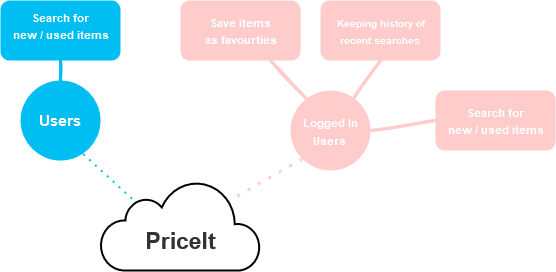

# PriceIt

PriceIt is a school project. 
The purpose of this project is to help reduce the vast amount of waste generated as the result of the online consumer market. 

PriceIt is a proof of concept that will is intended to give the user an opportunity to search various online markets (e.g. Ebay, FB Marketplace, Amazon, Google Shop, etc.) for both used and new items. 
It will also estimate how much the user will save upon going with the used items.

## System Overview Diagrams
 
<details><summary> System Overview</summary>


</details>


<details><summary>System Architecture Overview</summary>


</details>

## Getting Started

These instructions will get you a copy of the project up and running on your local machine for development and testing purposes. See deployment for notes on how to deploy the project on a live system.

### Prerequisites

What things you need to install the software and how to install them in a list form.

* Docker
* Internet Connection


### Installation

Prerequisites

1. Clone the repo
    ```
    $ git clone https://github.com/aaronalayo/priceit-backend.git
    ```
2. CD into project
3. Create a .env file inside the root directory

    Linux:
    ```
    $ vim .env
    ```

    Windows:
    ```
    $ New-Item .env
    ```

    fill out the .env e.g.
    
        SERVER_PORT=
        APP_ID=
        CLIENT_SECRET=
        DEV_ID=
        REDIRECT_URI=
        BASE_URL=
        GSECRET=

        MONGO_HOST=
        MONGO_PORT=
        MONGO_USERNAME=
        MONGO_PASSWORD=

        REDIS_PASSWORD=
        REDIS_HOST=
        REDIS_USERNAME=


4. Spin up a docker container 


    Linux:
    ```
    $ sudo docker-compose up -d
    ```

    Windows:
    ```
    $ docker-compose up -d
    ```

## Running the tests

Guide on running tests here

## Deployment

Guide on how to deploy (not necessary)

## Built With

Change below to match our things::::::

* [JavaScript](https://www.javascript.com/) - The Langauge used
* [NodeJS](https://nodejs.org/en/) - The runtime environment used
* [ExpressJS](https://expressjs.com/) - The Framework used
* [TypeScript](https://www.typescriptlang.org/) - The web framework used
* [ReactJS](https://reactjs.org/) - The library used to build frontend
* [MongooseJS](https://mongoosejs.com/) - The ODM used
* [Redis](https://redis.io/) - Used for caching searches
* [Redis](https://www.mongodb.com/) - Used as DB
* [Redis](https://joi.dev/) - Used for user input validation
* [Visual Studio Code](https://code.visualstudio.com/) - Editor Used

## Authors

[Aaron](https://github.com/aaronalayo)

[Zamanien](https://github.com/Zamanien)

## License

This project is licensed under the MIT License - see the [LICENSE.md](LICENSE.md) file for details